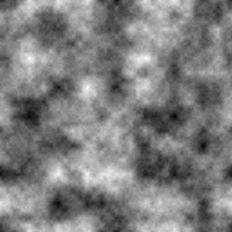

# fractal_noise

simple ruby script for generating images of 2D fractal noise using perlin noise or value noise

**Installation**

1. git clone git@github.com:mjwhitt/fractal_noise.git
2. cd fractal_noise/
3. bundle install --path vendor/

**Example Output**

> ./bin/value_noise -s 1138 -w 256 -h 256 -n

> ./bin/perlin_noise -s 1138 -w 256 -h 256 -n

**See Also**

* [Value Noise](http://www.spacedust.info/2014/06/value-noise/)
* [Value Noise - Extras](http://www.spacedust.info/2014/07/value-noise-extras/)
* [Value Noise - Tiled](http://www.spacedust.info/2014/08/value-noise-tiled/)
